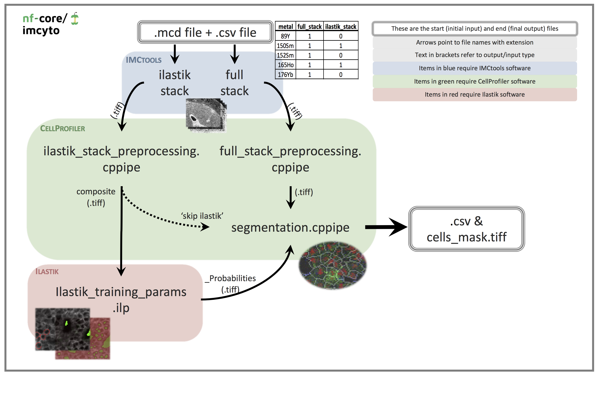
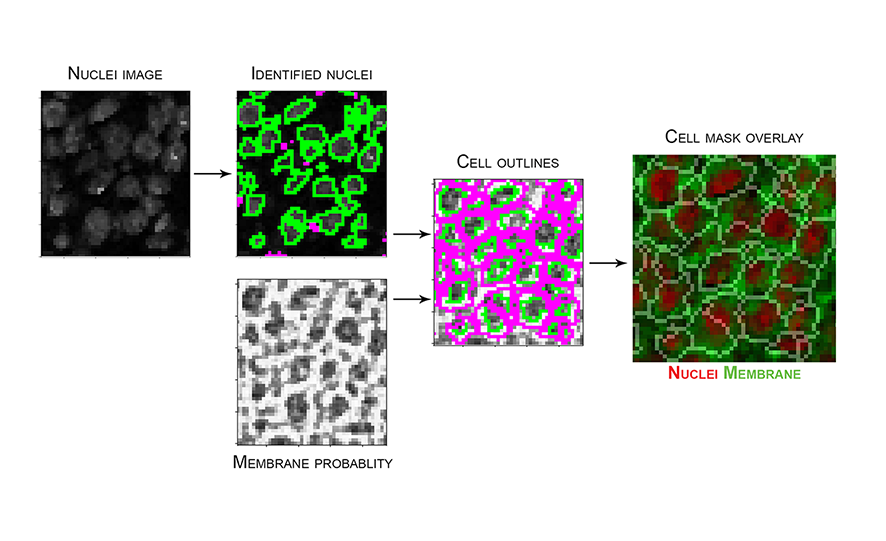
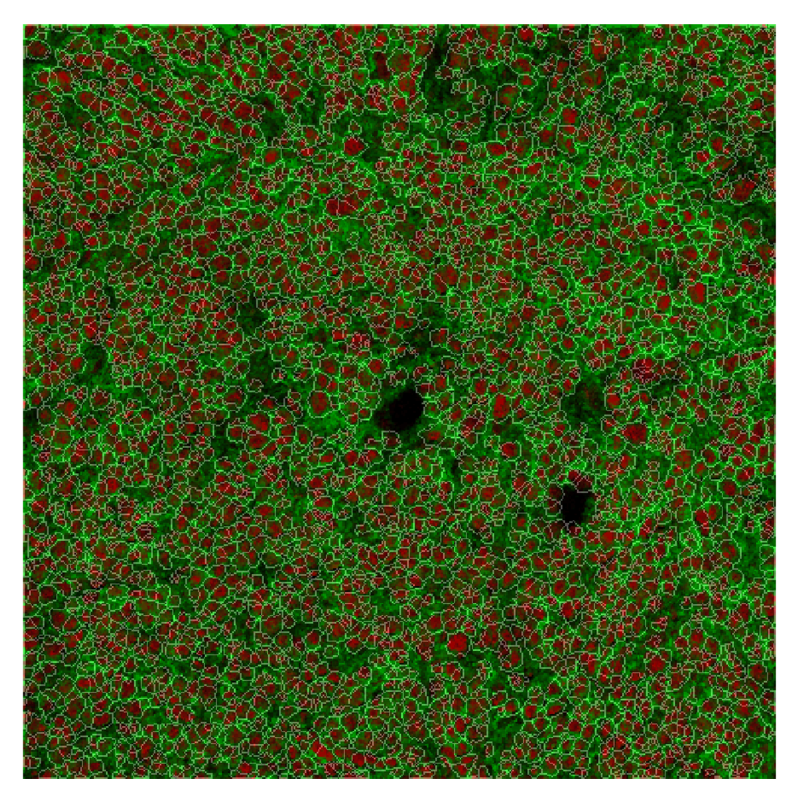
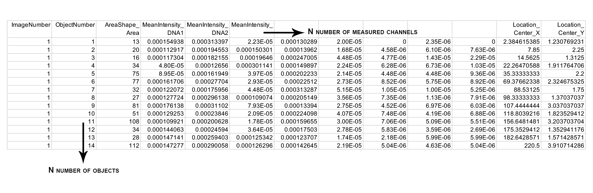

# nf-core/imcyto: Output

## Pipeline overview

The pipeline is built using [Nextflow](https://www.nextflow.io/). See main [`README.md`](../README.md#pipeline-summary) for a condensed overview of the steps in the pipeline, and the bioinformatics tools used at each step.

This is an automated image analysis pipeline that sequentially pre-processes and single cell segments imaging data to extract single cell expression data. This pipeline was generated for Imaging Mass Cytometry experiments, however, it is flexible enough to be applicable to other types of imaging data (e.g. immunofluorescence/immunohistochemistry data).

The input to the pipeline can be in either `mcd`, `tiff` or `txt` file format from which stacks of `tiff` files are generated for subsequent analysis. The various stages of this pipeline allow the `tiff` images to be pre-processed, and segmented using multiple CellProfiler `cppipe` project files and the pixel-classification software Ilastik. The concept of this step-wise image segmentation by combining Ilastik with CellProfiler was based on the analysis pipeline as described by the Bodenmiller group [(Zanotelli & Bodenmiller, Jan 2019)](https://github.com/BodenmillerGroup/ImcSegmentationPipeline/blob/development/documentation/imcsegmentationpipeline_documentation.pdf).

The project files supplied with the pipeline constitute the minimal requirements to generate a single cell mask. A more refined and comprehensive pipeline will be uploaded in due course.

This pipeline is designed to run on most compute infrastructures without the need to pre-install any of the software packages. However, in order to initially create the custom plugin files required by the pipeline, one needs to install the latest GUI versions of [CellProfiler](https://cellprofiler.org/releases/) and [Ilastik](https://www.ilastik.org/download.html) on a local machine (see [Customising inputs](#customising-inputs)).

## Pipeline schematic



## File prerequisites

1. `mcd`, `tiff` or `txt` data file(s) without any spaces in the file names. Associated antibody panel should contain metal and antibody information in the form of "metal_antibody" e.g. "89Y_CD45".

2. `metadata.csv` file containing your antibody panel to identify which `tiff` files are to be used for the full and Ilastik stacks. See [`--metadata.csv`](usage.md#--metadata) for the required file format.

3. CellProfiler `cppipe` files with the "NamesAndTypes" module edited to match your antibody panel and desired markers for the identification of cell nuclei and membranes (see [Customising inputs](#customising-inputs)). Other recommended changes to the pipeline are outlined in the [Pipeline details](#pipeline-details) section.

## Customising inputs

* To view, edit and create the `cppipe` files required by the pipeline you will have to download and install the [CellProfiler](https://cellprofiler.org/releases/) GUI locally. Custom CellProfiler plugins created by the Bodenmiller group (e.g `smoothmultichannel.py` and `measureobjectintensitymultichannel.py`) can be found [here](https://github.com/BodenmillerGroup/ImcPluginsCP). You can also create and use you own custom plugins. Open "CellProfiler > Preferences" and change the "CellProfiler plugins directory" path to where you have stored the custom plugins. When saving the edited `cppipe` files, make sure to export the file as a `cppipe`. If you would like to follow the naming convention in the schematic above you can name the files as either `full_stack_preprocessing.cppipe`, `ilastik_stack_preprocessing.cppipe` or `segmentation.cppipe`.

* If you use a custom module in any of the CellProfiler `cppipe` files make sure to also add it to the `plugins/` directory you will be supplying to the pipeline via the `--plugins` parameter (see [Pipeline execution](#pipeline-execution)).

* The pipeline uses a test-dataset that comes with a [pre-trained Ilastik pixel classifier](https://github.com/nf-core/test-datasets/blob/imcyto/plugins/ilastik_training_params.ilp), however if you would like to train a classifier using your own dataset then you will have to download and install [Ilastik](https://www.ilastik.org/download.html). The input image should be generated by using `ilastik_stack_preprocessing.cppipe` with CellProfiler. The desired composite RGB images can be provided in `tiff` format and you can use "membrane", "nuclei" and "background" labels to train your classifier. When exporting, select source as "Probabilities", transpose axis order to "cyx" and export output file as "tiff sequence" to generate the appropriate probability maps. If you would like to follow the naming convention in the schematic above you can name the file `ilastik_training_params.ilp`.

* The pipeline has an optional `--skip_ilastik` parameter which allows the Ilastik pixel classification step to be bypassed in favour of executing a CellProfiler only pipeline. In this case, the `--ilastik_training_ilp` parameter doesnt have to be provided, and images that have been pre-processed through `ilastik_stack_preprocessing.cppipe` will be directly passed to the `segmentation.cppipe`, therefore bypassing Ilastik. This approach might be preferred if CellProfiler alone is deemed sufficient to achieve a reliable segmentation mask.

* The pipeline has an optional `--compensation_tiff` parameter if you wish to apply a pre-determined spillover compensation function or illumination function to images during one or both of the full stack and Ilastik stack pre-processing steps. Examples of compensation might include: illumination correction to microscopy images or spillover compensation for Imaging Mass Cytometry data.

## Pipeline execution

Once you have created/obtained the files required to run the pipeline, the directory structure may look like the listing below:

```bash
.
├── inputs
│   ├── metadata.csv
│   └── sample_name.mcd
└── plugins
    ├── cp_plugins
    │   ├── measureobjectintensitymultichannel.py
    │   └── smoothmultichannel.py
    ├── full_stack_preprocessing.cppipe
    ├── ilastik_stack_preprocessing.cppipe
    ├── ilastik_training_params.ilp
    └── segmentation.cppipe
```

Providing you have installed the version of Nextflow required by the pipeline, and you either have Docker or Singularity installed and available on the `PATH`, you can then execute the pipeline on your compute infrastructure using the command below:

```bash
nextflow run nf-core/imcyto \
    --input "./inputs/*.mcd" \
    --metadata './inputs/metadata.csv' \
    --full_stack_cppipe './plugins/full_stack_preprocessing.cppipe' \
    --ilastik_stack_cppipe './plugins/ilastik_stack_preprocessing.cppipe' \
    --ilastik_training_ilp './plugins/ilastik_training_params.ilp' \
    --segmentation_cppipe './plugins/segmentation.cppipe' \
    --plugins './plugins/cp_plugins/' \
    -profile <docker/singularity/institute>
```

Nextflow will automatically download the pipeline and its associated software containers in order to execute the pipeline. See [Adding your own cluster configuration](https://nf-co.re/usage/adding_own_config) for tips on how to customise the pipeline execution for your compute infrastructure.

## Inputs/outputs

Each step of the pipeline as depicted in the pipeline schematic is broken down and explained below, with the inputs and outputs highlighted. The directories listed below will be created in the output directory after the pipeline has finished. All paths are relative to the top-level `results/` directory.

### 1. imctools

*Input files*:  

* `mcd`, `tiff` or `txt` file
* `metadata.csv` file

*Output files*:

* `imctools/<SAMPLE>/*.csv`  
* `imctools/<SAMPLE>/<ROI>/full_stack/*.tiff`  
* `imctools/<SAMPLE>/<ROI>/full_stack.ome.tiff`  
* `imctools/<SAMPLE>/<ROI>/ilastik_stack/*.tiff`  
* `imctools/<SAMPLE>/<ROI>/ilastik_stack.ome.tiff`  

*Description*:  

* Parse data files for ROI information and convert each channel into individual `tiff` files.
* Uses `metadata.csv` to sort `tiff` files into corresponding folders i.e. `full_stack/` or `ilastik_stack/`.

### 2. Pre-process full stack

*Input files*:  

* Full stack of `tiff` images generated by imctools step

*Output files*:

* `preprocess/<SAMPLE>/<ROI>/full_stack/*.tiff`  

*Description*:  

* This step selects all images in `full_stack` folder and sequentially processes them through various filtering methods, including removal of hot pixels and median filtering, and then saves all files.
* These image filtering parameters can be changed by opening and customising the `cppipe` file in CellProfiler.
* To keep your data raw, uncheck all the modules except "SaveImages". This will simply re-save the unchanged input images into the correct place for the next step in the pipeline.
* Make sure to export a `cppipe` file.

### 3. Pre-process Ilastik stack

*Input files*:  

* Ilastik stack of `tiff` images generated by imctools step

*Output files*:

* `preprocess/<SAMPLE>/<ROI>/ilastik_stack/composite.tiff`  

*Description*:  

* This step first selects specific files by finding matching names and labels them as either "membrane" and "nuclei". These images are then filtered and merged to create an RGB composite image, which is saved as `composite.tiff`.
* Open `cppipe` file in CellProfiler to change names of input images in "NamesAndTypes". Select markers that are representative of total cell plasma membranes and cell nuclei. If one marker does not cover all cell type membranes, then various membrane markers can be merged by adding in an "ImageMath" module to create a total membrane image, this image will need to be titled "membrane".
* Further parameters can be customised, such as the filtering methods and parameters.
* Make sure to export a `cppipe` file.

### 4. Ilastik

*Input files*:  

* `composite.tiff` generated by Pre-process Ilastik stack step.

*Output files*:

* `ilastik/<SAMPLE>/<ROI>/composite_Probabilities_0.tiff` (membrane)
* `ilastik/<SAMPLE>/<ROI>/composite_Probabilities_1.tiff` (nuclei)
* `ilastik/<SAMPLE>/<ROI>/composite_Probabilities_2.tiff` (background)

*Description*:  

* Pixels are classified into three sets: membrane, nuclei and background by Ilastik using a pre-trained pixel classifier to generate and save a probability map of each.
* If required, the Ilastik classifier can be retrained using a new dataset. These inputs should be the output composite image of the `ilastik_stack_preprocessing` step. When selecting export settings, select source as "Probabilties", transpose axis order to "cyx" and export output file as "tiff sequence" to generate probability maps.
* Make sure to save ilastik classifier as "ilastik_training_params.ilp".
* The `--skip_ilastik` parameter can be used to skip the Ilastik pixel classification altogether. In this case, the `--ilastik_training_ilp` parameter doesnt need to be provided, and images that have been pre-processed through the `ilastik_stack_preprocessing.cppipe` will be directly passed to the `segmentation.cppipe`, therefore bypassing Ilastik.

### 5. Segmentation

*Input files*:  

* pre-processed full_stack of .tiff images generated by full_stack_preprocessing step and composite_Probabilities_ generated by Ilastik or composite.tiff if Ilastik is skipped.

*Output files*:

* `segmentation/<SAMPLE>/<ROI>/Cells.csv`
* `segmentation/<SAMPLE>/<ROI>/Cells_mask.tiff`

*Description*:  

* Open .cppipe file in CellProfiler to change names of input images in ‘NamesAndTypes’ to match your antibody panel, making sure to keep "_Probabilities_0" as prob_membrane and "_Probabilities_2" as prob_background.
* Currently, this process uses the nuclear image to identify nuclei as primary objects, subtracts background probability from the membrane probability image and then uses both identified nuclei and membrane probability to identify whole cells as secondary objects. These cell objects are then converted into a uint16 image to generate the cell mask and saved. The cell mask is then used to measure size and shape information of all cell objects, and extract single cell expression data.
* You may need to adapt parameters present in "IdentifyPrimaryObjects" and "IdentifySecondaryObjects" modules to best suit your data. Common changes include typical diameter size in pixels of nuclear objects, thresholding strategy and method to distinguish clumped objects. Alternatively, one can opt for using the nuclei probability output ("_Probabilities_1") from Ilastik to identify the nuclei as primary objects.
* Within "MeasureObjectIntensity Multichannel" you will need to select all the images that you would like the intensity to be measured for.
* Further parameters can be customised, such as the desired measurements to export in "ExportToSpreadsheet". Currently this pipeline exports data only for each cell object: area, mean intensity, object center location and object number.
* Make sure to export a `cppipe` file.
* Image below represents an example of the steps in `segmentation.cppipe`, with nuclei image input from `full_stack_preprocessing` and membrane probability input from Ilastik, to generate the resulting cell mask. Mask overlay image created in [HistoCAT](http://www.bodenmillerlab.com/research-2/histocat/) with nuclei and membrane channels coloured in red and green, respectively.



### 6. Pipeline reporting

*Output files*:

* `pipeline_info/`  
  * Reports generated by the pipeline - `pipeline_report.html`, `pipeline_report.txt` and `software_versions.csv`.  
  * Reports generated by Nextflow - `execution_report.html`, `execution_timeline.html`, `execution_trace.txt` and `pipeline_dag.svg`.
* `Documentation/`  
  * Documentation for interpretation of results in HTML format - `results_description.html`.

*Description*:  

* Nextflow provides excellent functionality for generating various reports relevant to the running and execution of the pipeline. This will allow you to trouble-shoot errors with the running of the pipeline, and also provide you with other information such as launch commands, run times and resource usage.

## Example pipeline output

Cell mask overlay image created in [HistoCAT](http://www.bodenmillerlab.com/research-2/histocat/) with nuclei, tumour cells and non-tumour cell channels coloured in red, green and blue, respectively.



Output `csv` file containing each cell object and measured mean intensities:



## Common errors and solutions

When there are errors with the execution of the pipeline, the pipeline log will tell you exactly which process has caused the error, the command output and the command error, as well as the path to a unique directory (e.g. `work/00/c7ac5c89d10e234abaf25b2213634b`) where the process would have been executed.

> If the pipeline fails to run, in the first instance try to re-run it with the addition of the `-resume` parameter

### Channel naming

```bash
Command output: CP-JAVA 15:04:54.326 [Thread-0] WARN  o.c.imageset.ChannelFilter - Channels have different numbers of images
Command error: ... Error for image set, channel=1, metadata=CD4: Image missing from channel
```

Check the images chosen in `metadata.csv` match the names chosen in the CellProfiler "NamesandTypes" modules. Make sure all metal names are correct and unambiguous (e.g. CD4 will find both CD4 and CD44 in "NamesandTypes").

### Missing output files

```bash
Caused by: Missing output file(s) 'ilastik_stack/*' expected by process 'PreprocessIlastikStack (file_name_roi_1)'
```

Reopen the corresponding CellProfiler `cppipe` file and check that the "SaveImages" module is set to give the correct output, re-export this and re-run the pipeline by using the `-resume` parameter.

### ROI size

For ROIs larger than ~2000-2000um the pipeline may struggle/fail to complete due to the excessive memory requirements during the "IdentifyObjects" module in `segmentation.cppipe`. As a workaround for this we recommend adding in a "Crop" module before identifying objects to crop your images into two. Make sure to duplicate any subsequent modules and adjust input names as required.

## Related software

* The [MCD Viewer](https://www.fluidigm.com/software) software provided by the Hyperion imaging system allows users to visualise, review and export `mcd` image files.

* [Fiji-ImageJ](https://imagej.net/Fiji) can be used to view `mcd` files but requires downloading the imctools plugin. This plugin allows the `mcd` file to be viewed as an image5D with your antibody markers as individual channels that can be toggled on/off.

* [QuPath](https://qupath.github.io/) can be used for visualisation with the added benefit of viewing all channels at once in a mini viewer panel.

* [HistoCAT](http://www.bodenmillerlab.com/research-2/histocat/) developed by the Bodenmiller lab enables visualisation of images and contains various analysis tools including PhenoGraph, tSNE, PCA and Neighbourhood analysis.
